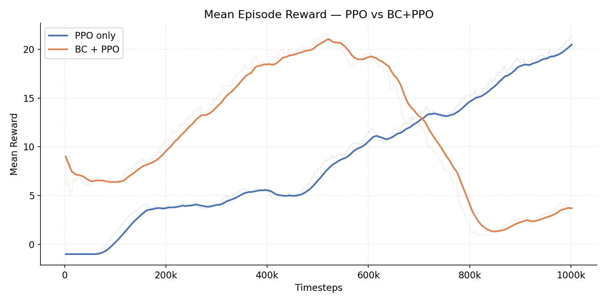
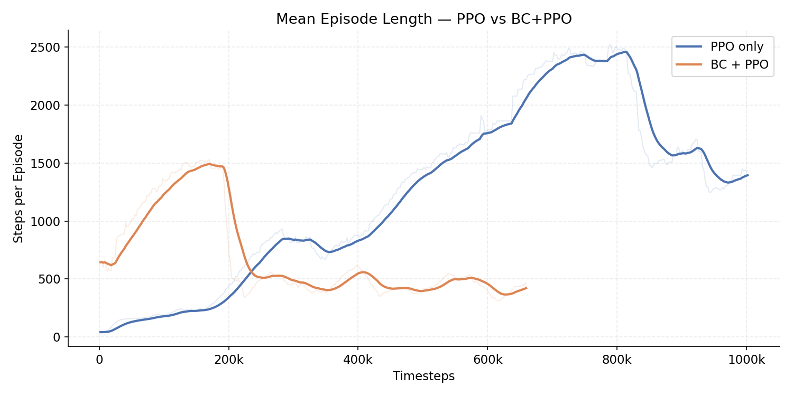
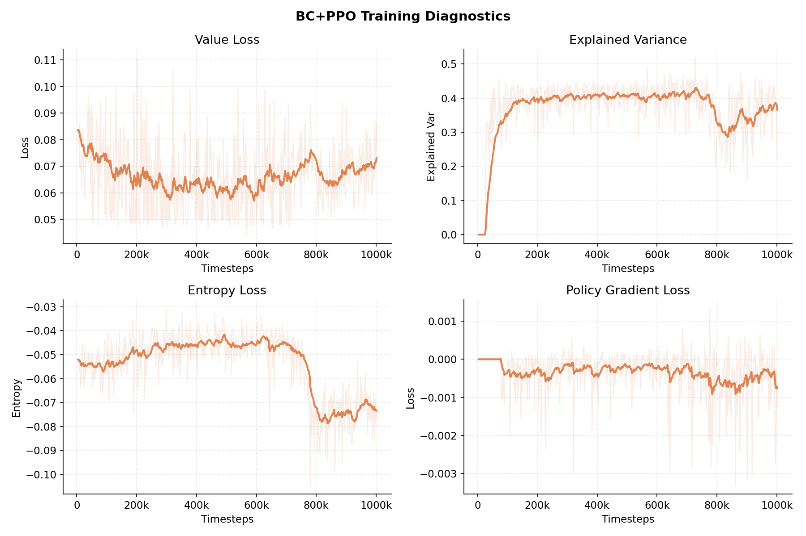
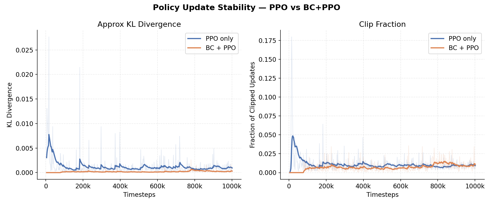

# Flappy Bird RL: Behavioral Cloning + PPO vs PPO

A Flappy Bird game built from scratch in Pygame and wrapped as a [Gymnasium](https://gymnasium.farama.org/) environment, used to compare **Behavioral Cloning (BC) + PPO against PPO by iteself**

---

## Trained Agent Demo


---

## Project Overview

RL agents learning Flappy Bird from scratch face a fundamental challenge, the reward signal is extremely sparse early in training. The bird crashes quickly, receives a -1 reward, and the agent has very little to learn from.

This project tests a practical solution, to pretrain the agent on human gameplay demonstrations via Behavioral Cloning, then refine it later with PPO. The idea is that a BC initialized agent should be able to reach a good performance faster than one starting from random weights.

The results confirmed this and also revealed an interesting training instability in combining BC + PPO.

---

## Results Summary

| | PPO | BC + PPO |
|---|---|---|
| Peak average reward | ~21 | ~21 |
| Timesteps to reach ~20 reward | ~1M | ~500k |
| Training stability | Stable | Collapsed at ~800k |

Behavioral cloning significantly accelerated early learning reaching the same performance level in roughly half the timesteps but introduced a later training instability that pure PPO avoided. 

It is worth noting that the BC model was only trained on 20 human episodes with the rewards ranging from 15 to 41, with the mean and median both being 24.0, it is worth testing again with more episodes and a better average score for them.

---

## Key Contributions

- **Custom Gymnasium environment** - built a complete Flappy Bird game in Pygame and wrapped it as a Gym environment with normalized observations, deterministic timesteps, and a score based truncation condition
- **Human demonstration logging** - implemented a real-time gameplay recording system that captures `(obs, action, next_obs, reward, done)` transitions and filters episodes by quality
- **Behavioral cloning pipeline** - trained a BC policy on human demonstrations using the `imitation` library, with the saved weights directly loadable by SB3's PPO
- **BC + PPO integration** - initialized a PPO actor from BC weights and fine-tuned with a reduced learning rate to preserve the demonstration-derived policy
- **Controlled experimental comparison** - trained both agents to 1M timesteps with identical environments and logged TensorBoard diagnostics for comparison

---

## Training Pipeline

```
Human Gameplay  →  collect_human_data.py
      ↓
Demonstration Dataset  (obs, action, next_obs, reward, done)
      ↓
Behavioral Cloning  →  train_bc.py
      ↓
Initialized PPO Policy  →  finetune_ppo.py
      ↓
Final Agent
```

The BC stage trains only the actor via supervised learning on human demonstrations. PPO then takes over with a randomly initialized critic, using the BC policy as its starting point rather than random weights.

---

## Methods

### PPO (Baseline)
Proximal Policy Optimization trains an agent from random weight initialization using environment rewards alone. Uses SB3's implementaion of PPO with `MlpPolicy` using the 5D observation space defined below.

### Behavioral Cloning
Human gameplay is recorded as `(obs, action, next_obs, reward, done)` transitions using `collect_human_data.py`. Only episodes scoring ≥ 15 pipes are kept to ensure a base quality for each episode. A BC policy is trained on these demonstrations using the `imitation` library via supervised learning.

### BC + PPO
The BC trained weights initialize the PPO actor network. PPO then fine tunes from this warm start using a reduced learning rate (`1e-4`) to avoid overwriting the BC initialization early in training. The critic remains randomly initialized.

---

## Environment

Custom Flappy Bird implemented in Pygame, wrapped as a Gymnasium environment.

| Property | Value |
|---|---|
| Observation space | `Box(5,)` float32 → (bird y, velocity, next pipe x, pipe top y, pipe bottom y) all normalized to [0, 1] |
| Action space | `Discrete(2)` → 0: do nothing, 1: flap |
| Reward | +1 per pipe passed, −1 on death, 0 otherwise |
| Termination | Bird collides with a pipe or boundary |
| Truncation | Score exceeds `MAX_SCORE` (250) → episode ends as a success |
| Timestep | Fixed 60 FPS |

---

## Results

### 1. Reward Comparison



BC+PPO starts strong (~9 mean reward at step 0) and peaks at ~**21 around 500k timesteps**. It then collapses sharply to ~**2** around **800k timesteps**, partially recovering to ~4 by 1M. PPO alone starts below zero and climbs steadily throughout, reaching ~**20-21** by **1M timesteps**.

### 2. Episode Length



Longer episodes correspond to better gameplay. BC+PPO starts at ~1100 steps and peaks at ~**2200 steps around 500k timesteps**, then collapses to ~**330 steps around 800k**, partially recovering to ~550 by 1M. PPO alone rises steadily throughout, reaching ~**2150 steps by 1M**, mirroring the reward curve.

### 3. Training Diagnostics (BC+PPO)



Shows value loss, explained variance, entropy loss, and policy gradient loss for BC+PPO across the full 1M timesteps. Explained variance rises from near zero to ~0.5 in the first 100k timesteps as the critic catches up to the BC initialized actor, then drops sharply around the collapse at ~800k. Entropy loss gradually decreasing indicates the policy becoming more deterministic over time.

### 4. KL Divergence and Clip Fraction



Both PPO and BC+PPO are shown. PPO alone has high initial KL divergence ( ~0.025) and clip fraction ( ~0.175), reflecting large updates from random weights. BC+PPO shows much lower and more stable values throughout. This shows that the BC initialization starts the policy in a better region and requires less aggressive updating early in training.

---

## Key Findings

- **BC dramatically speeds up early learning.** The BC initialized agent starts at ~9 mean reward and reaches ~21 by 500k timesteps, a level PPO alone doesn't reach until ~1M timesteps.
- **PPO alone is slower but stable.** Without an imitation warm start, PPO climbs gradually and consistently throughout, ending near ~21 at 1M with no collapse.
- **BC+PPO can suffer from policy collapse.** After peaking at ~21 around 500k timesteps, the BC+PPO policy collapses sharply to ~2 by 800k and only partially recovers. This is the **value function cold start problem**: the critic is randomly initialized while the actor starts from a strong BC policy. Once the critic becomes confident enough to drive large gradient updates, those updates are based on biased value estimates, pushing the actor into worse regions of parameter space. The degraded actor then produces worse rollouts, making the critic's estimates worse still. A compounding feedback loop.

Potential Fixes: pre-warm the critic on BC rollouts before PPO begins, reduce the learning rate further, or add a KL penalty to slow policy drift.

---

## Project Structure

```
flappy-bc-ppo/
├── flappy/
│   ├── game.py               # Pygame Flappy Bird game engine
│   └── env.py                # Gymnasium wrapper (obs, action, reward)
├── tensorboard_logs/         # Training logs
│   ├── PPO_log/
│   └── finetuned_PPO_log/
├── human_data/               # Human demonstration episodes (.npz)
├── models/                   # Saved model checkpoints
├── train_ppo.py              # Train PPO from scratch (baseline)
├── train_bc.py               # Train BC policy on human demonstrations
├── finetune_ppo.py           # Fine-tune BC policy with PPO
├── collect_human_data.py     # Play the game and log demonstrations
└── evaluate.py               # Evaluate any saved model
```

---

## Getting Started

```bash
pip install -r requirements.txt
```

**Play the game**
```bash
python -m flappy.game
```

**Collect human demonstrations**
```bash
python collect_human_data.py
python collect_human_data.py --max_episodes 30
```

**Train BC on demonstrations** (Should collect 15+ episodes to see results)
```bash
python train_bc.py
python train_bc.py --n_epochs 100 --batch_size 64
```

**Fine tune BC model with PPO (BC+PPO pipeline)**
```bash
python finetune_ppo.py
python finetune_ppo.py --total_timesteps 1_000_000
```

**Train PPO from scratch (baseline)**
```bash
python train_ppo.py
```

**Evaluate a model** (Leave out --fps XX for uncapped)
```bash
python evaluate.py --model models/flappyPPO_finetuned_best_model --fps 60
python evaluate.py --model models/flappyPPO_best_model --fps 60
python evaluate.py --headless --episodes 50
```

**View training curves**
```bash
tensorboard --logdir=./tensorboard_logs/
```

---

## Tech Stack

- **Python**
- [Pygame](https://www.pygame.org/) — custom Flappy Bird game engine
- [Gymnasium](https://gymnasium.farama.org/) — RL environment interface
- [Stable-Baselines3](https://stable-baselines3.readthedocs.io/) — PPO implementation
- [Imitation](https://imitation.readthedocs.io/) — Behavioral Cloning
- [PyTorch](https://pytorch.org/) — neural network backend
- NumPy · Matplotlib